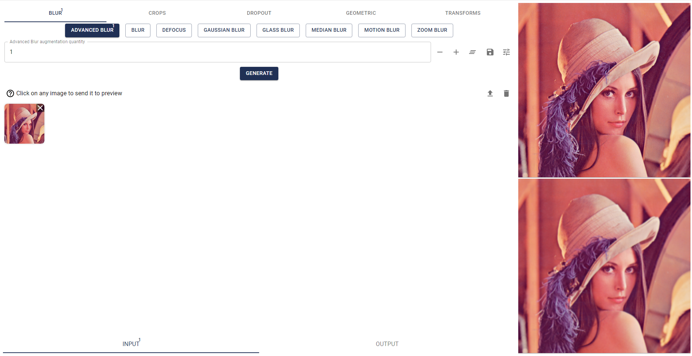

# AugmentationUI

A local web application providing a UI for image augmentation based on the [albumentations](https://albumentations.ai/)
library



## Table of Content

* [What is image augmentation](#what-is-image-augmentation)
* [Prerequisites](#prerequisites)
* [Installation](#installation)
* [Usage](#usage)
* [Custom arguments](#custom-arguments)
* [Supported image formats](#supported-image-formats)
* [List of augmentations](#list-of-augmentations)
    * [Blur](#blur)
    * [Crops](#crops)
    * [Dropout](#dropout)
    * [Geometric](#geometric)
    * [Transforms](#transforms)
* [API endpoints](#api-endpoints)

## What is image augmentation

[_Image augmentation_](https://en.wikipedia.org/wiki/Data_augmentation) is a technique used in machine learning and
computer vision to artificially increase the size and
diversity of a dataset by applying various transformations to the original images.

These transformations can include operations such as rotation, scaling, flipping, cropping, and color adjustments.

The primary goal of image augmentation is to enhance the robustness and generalization of models by providing them with
a broader range of examples during
training.

This method is commonly employed in various applications, including, but not limited to, training models for tasks like
image classification, object detection, and generative models such as LoRA (Low-Rank Adaptation) for Stable
Diffusion.

## Prerequisites

- **Python**: Required for the Flask-based server.
- **Node.js**: Required for the React-based client (only if not using the `API_ONLY` argument).

## Installation

```
git clone https://github.com/numq/augmentation-ui.git
```

## Usage

### Run application

#### Windows

Run with default arguments

```
  start.bat
```

Run with custom arguments

```
  start-args.bat
```

#### Linux/macOS

Run with default arguments

```
  start.sh
```

Run with custom arguments

```
  start-args.sh
```

## Custom arguments

* `AUGMENTATION_SERVICE_URL_SCHEME`

  Server and client url scheme.

  Default: `http`


* `AUGMENTATION_SERVICE_HOST`

  Server and client host.

  Default: `127.0.0.1`


* `AUGMENTATION_SERVICE_PORT`

  Server and client port.

  Default: `5000`


* `DISABLE_AUTO_OPEN`

  Do not open the page automatically after startup.

  Default: `0`


* `API_ONLY`

  Run only server to use API.

  Default: `0`

## Supported image formats:

* `bmp`
* `jpg`
* `jpeg`
* `png`
* `webp`

## List of augmentations

### Blur

* **Blur**
    + Apply a blur effect to the image, making it less sharp.
* **Motion Blur**
    + Simulate motion blur by blurring the image in a specific direction.
* **Gaussian Blur**
    + Apply a Gaussian blur to the image, which is a type of blur that preserves edges and details.
* **Glass Blur**
    + Apply a blur effect that simulates the distortion caused by looking through glass.
* **Advanced Blur**
    + Apply a combination of blur effects to the image, such as motion blur and Gaussian blur.
* **Median Blur**
    + Apply a median filter to the image, which replaces each pixel with the median value of neighboring pixels.
* **Defocus**
    + Simulate camera defocus by blurring the image in a specific area.
* **Zoom Blur**
    + Simulate zooming in or out by blurring the image.

### Crops

* **Random Crop**
    + Randomly crop a portion of the image.
* **Center Crop**
    + Crop the center portion of the image.
* **Crop**
    + Manually specify a crop region to apply to the image.
* **Random Resized Crop**
    + Randomly crop and resize a portion of the image.
* **Random Crop From Borders**
    + Randomly crop from the borders of the image.

### Dropout

* **Channel Dropout**
    + Randomly drop out (set to zero) channels in the image.
* **Coarse Dropout**
    + Randomly drop out larger areas of the image.
* **Grid Dropout**
    + Drop out entire rows or columns of pixels in the image.

### Geometric

* **Random Scale**
    + Randomly scale the image up or down.
* **Longest Max Size**
    + Scale the image to its longest dimension while keeping aspect ratio.
* **Smallest Max Size**
    + Scale the image to its smallest dimension while keeping aspect ratio.
* **Resize**
    + Manually specify a new size for the image.
* **Rotate**
    + Rotate the image by a random angle or by a specified angle.
* **Random Rotate 90**
    + Rotate the image by 90 degrees (either clockwise or counterclockwise).
* **Safe Rotate**
    + Rotate the image while ensuring that it remains within a specified bounding box.
* **Elastic Transform**
    + Apply an elastic transformation to the image, which stretches and compresses it in different directions.
* **Perspective Transform**
    + Apply a perspective transformation to the image, which can distort it and change its shape.
* **Affine Transform**
    + Apply an affine transformation to the image, which can rotate, scale, and translate it.
* **Vertical Flip**
    + Flip the image upside down.
* **Horizontal Flip**
    + Flip the image horizontally (i.e., mirror it).
* **Flip**
    + Randomly flip the image horizontally or vertically.
* **Transpose**
    + Transpose the image (i.e., swap its rows and columns).
* **Optical Distortion**
    + Apply optical distortion to the image, which can cause it to appear curved or distorted.
* **Grid Distortion**
    + Apply grid-like distortion to the image, which can cause it to appear distorted or warped.
* **Pad If Needed**
    + Pad the image with zeros if it is smaller than a specified size.

### Transforms

* **Normalize**
    + Normalize pixel values in the range [0, 1].
* **Random Gamma**
    + Randomly adjust gamma correction of the image, which affects its brightness and contrast.
* **Random Grid Shuffle**
    + Randomly shuffle grid cells in the image, which can cause it to appear distorted or disordered.
* **Hue Saturation Value**
    + Adjust hue, saturation, and value (brightness) of individual pixels in the image.
* **RGB Shift**
    + Shift RGB channels of individual pixels in the image.
* **Gauss Noise**
    + Add Gaussian noise to the image, which can simulate random variations in brightness and contrast.
* **CLAHE** (Contrast Limited Adaptive Histogram Equalization)
    + Apply histogram equalization to adjust contrast and brightness of individual regions in the image.
* **Channel Shuffle**
    + Randomly shuffle channels (RGB or grayscale) in each pixel of the image.
* **Invert Image**
    + Invert all pixel values in the image (i.e., convert black to white and vice versa).
* **To Gray Scale**
    + Convert color images to grayscale by averaging RGB channels or using other methods.
* **To Sepia Tone**
    + Convert color images to sepia tone by adjusting RGB channels to produce a warm, vintage appearance.
* **Image Compression**
    + Compress images using lossy compression algorithms like JPEG or WebP.
* **Random Brightness Contrast**
    + Randomly adjust brightness and contrast of individual pixels in images.

## API Endpoints

### GET /augmentations

Retrieve a list of available augmentations

#### Response Message Body:

```json
{
  "augmentations": [
    {
      "category": "blur",
      "id": "blur",
      "name": "Blur"
    },
    {
      "category": "blur",
      "id": "motion_blur",
      "name": "Motion Blur"
    }
  ]
}
```

### POST /generate

Apply an augmentation to an image and get the augmented image

#### Request Message Body:

```json
{
  "augmentation_id": "BlurAugmentation",
  "image_data": "data:image/png;base64,..."
}
```

#### Response Message Body:

```json
{
  "image_data": "data:image/png;base64,..."
}
```